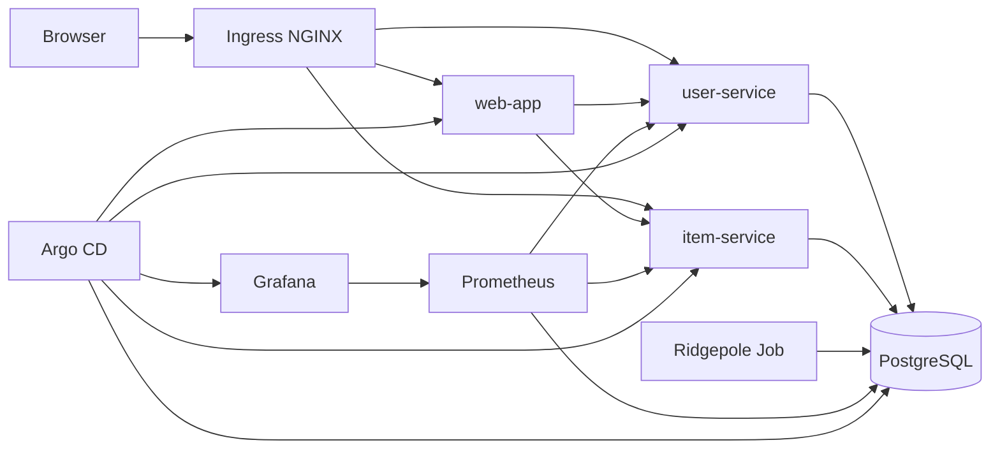

# kind Study Hands-on

このリポジトリは、kind を使ってローカルに Kubernetes 学習環境を作り、以下の構成を段階的に学ぶためのハンズオンです。

- control plane 1 台
- worker 3 台
- 永続化された PostgreSQL
- REST API サーバー 2 つ
- Web アプリ 1 つ
- Argo CD
- Grafana
- Ridgepole による DB スキーマ管理

## まず結論

学習用としては、次のような構成が最もバランスが良いです。

- kind クラスタ: control plane 1、worker 3
- Ingress: ingress-nginx
- DB: PostgreSQL StatefulSet + PersistentVolumeClaim
- API: user-service、item-service をそれぞれ Deployment + Service で配置
- Frontend: web-app を Deployment + Service + Ingress で公開
- DB スキーマ: Ridgepole を Job または CI から実行
- 監視: kube-prometheus-stack を入れて Grafana を利用
- GitOps: Argo CD で apps と infra を継続的に同期

この構成にすると、Kubernetes の基礎だけではなく、実務に近い以下の論点を一通り触れられます。

- stateless と stateful の違い
- Service によるサービスディスカバリ
- Ingress による入口の統一
- Secret / ConfigMap の責務分離
- PersistentVolume による永続化
- 監視と可観測性
- DB スキーマ変更の運用
- GitOps による変更管理

## 推奨アーキテクチャ



## 学ぶ順番

1. kind クラスタの確認
2. Namespace の設計
3. PostgreSQL の永続化
4. user-service / item-service の配備
5. web-app と Ingress の配備
6. Ridgepole によるスキーマ管理
7. Grafana による監視
8. Argo CD による GitOps
9. 障害注入、スケール、ロールアウトの確認

## Namespace 設計

学習時点では、細かく分けすぎない方が理解しやすいです。次の 4 つを推奨します。

- infra: PostgreSQL、ingress-nginx
- apps: user-service、item-service、web-app
- observability: Prometheus、Grafana
- gitops: Argo CD

目的:

- 何を基盤とみなすかを整理できる
- 権限や責任範囲の考え方を学べる
- 運用時に障害切り分けしやすい

実務上のメリット:

- 運用担当とアプリ担当で管理境界を持てる
- NetworkPolicy や RBAC を後から足しやすい
- GitOps の同期単位を分けやすい

## コンポーネントごとの学習ポイント

### PostgreSQL

目的:

- Kubernetes で stateful workload を扱う基本を学ぶ

学ぶこと:

- StatefulSet と Deployment の違い
- PersistentVolumeClaim の意味
- Secret に DB 認証情報を置く理由
- DB を Service 経由で参照する方法

実務上のメリット:

- アプリ再作成時にもデータが残る設計を理解できる
- バックアップ、復旧、マイグレーションの考え方につながる

### user-service / item-service

目的:

- マイクロサービスの最小構成を学ぶ

学ぶこと:

- Deployment、Service、ConfigMap、Secret
- readinessProbe / livenessProbe
- API ごとの独立デプロイ

実務上のメリット:

- 一部機能だけの更新やスケールが可能になる
- 障害を局所化しやすくなる

### web-app

目的:

- ブラウザ向けフロントエンドを Kubernetes で配備する流れを学ぶ

学ぶこと:

- Ingress によるルーティング
- API とフロントの責務分離

実務上のメリット:

- エンドポイント管理が単純になる
- フロントと API のデプロイを分離できる

### Ridgepole

目的:

- DB スキーマを手作業ではなくコードで管理する考え方を学ぶ

学ぶこと:

- スキーマ定義のバージョン管理
- アプリ配備前後の migration 戦略
- Job と CI の使い分け

実務上のメリット:

- 環境差分による事故を減らせる
- レビュー可能な DB 変更フローを作れる

### Grafana

目的:

- システムが動いているかではなく、どう壊れているかを見られるようにする

学ぶこと:

- CPU / Memory 使用量
- Pod 再起動回数
- API レイテンシ
- PostgreSQL メトリクス

実務上のメリット:

- 障害の初動が速くなる
- 改善前後の比較ができる

### Argo CD

目的:

- kubectl 直打ちではなく、Git を正とする運用を学ぶ

学ぶこと:

- 宣言的構成管理
- 自動同期と差分検知
- Rollback の考え方

実務上のメリット:

- 誰が何を変えたか追跡しやすい
- 手作業デプロイによる設定ドリフトを減らせる

## 推奨ディレクトリ構成

この学習を進めるなら、将来的には次のような構成にすると扱いやすいです。

```text
.
├── kind-study.yaml
├── README.md
├── docs/
│   ├── handson.md
│   ├── handson1.md
│   ├── handson2.md
│   ├── handson3.md
│   ├── handson4.md
│   ├── handson5.md
│   ├── handson6.md
│   ├── handson7.md
│   ├── handson8.md
│   ├── handson9.md
│   └── handson10.md
├── manifests/
│   ├── base/
│   │   ├── postgres/
│   │   ├── user-service/
│   │   ├── item-service/
│   │   ├── web-app/
│   │   ├── ingress/
│   │   ├── monitoring/
│   │   └── argocd/
│   └── overlays/
│       └── local/
└── schema/
    └── Schemafile
```

この形にする理由:

- base と overlay で Kustomize を学びやすい
- Argo CD にそのまま載せやすい
- DB スキーマとアプリ構成を一緒に管理できる

## ハンズオン

詳細な手順は [docs/handson.md](docs/handson.md) から順番に進めてください。

## 補足

Ridgepole は Ruby 系プロジェクトでよく使われます。もし言語スタックに依存しないツールを使いたいなら、Flyway や Liquibase に置き換えても学習の本質は変わりません。